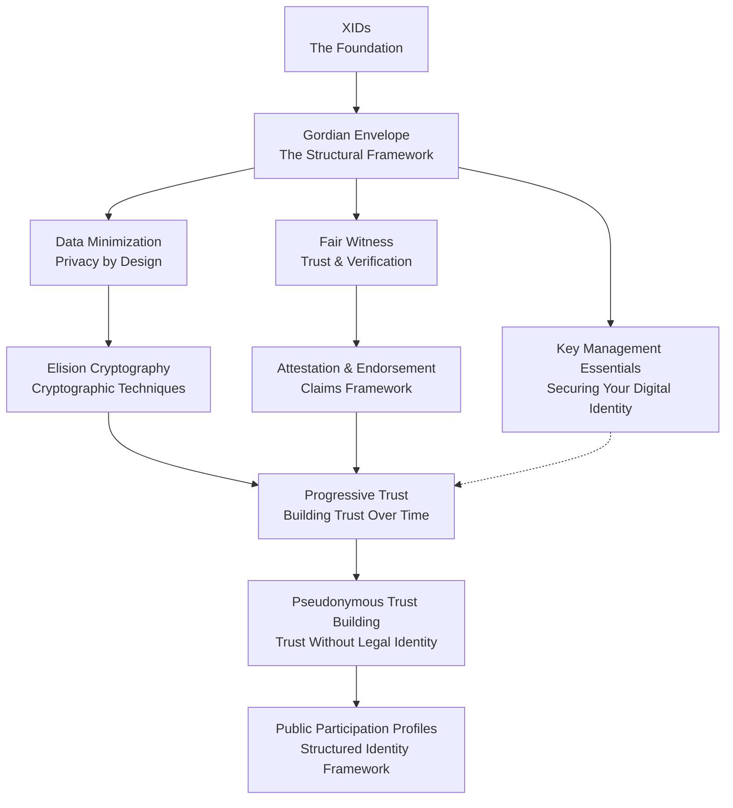

# XID Tutorial: Core Concepts

## Table of Contents
- [Introduction to XIDs and Gordian Architecture](#introduction-to-xids-and-gordian-architecture)
- [Core Concepts](#core-concepts)
- [Trust Model Concepts](#trust-model-concepts)
- [Privacy & Identity Concepts](#privacy--identity-concepts)
- [Concept Map](#concept-map)
- [Relating Concepts to Tutorials](#relating-concepts-to-tutorials)
- [Reading Approach](#reading-approach)
- [Questions to Consider](#questions-to-consider)
- [Next Steps](#next-steps)

## Introduction to XIDs and Gordian Architecture

The XID-Quickstart tutorial introduces developers to the Gordian architecture—a comprehensive technology stack developed by Blockchain Commons that embodies the principles of self-sovereign identity, data minimization, and progressive trust building. 

The Gordian architecture consists of several components that work together to enable user-controlled digital identity and data:
- **XIDs** (eXtensible IDentifiers): Privacy-respecting digital identifiers
- **Gordian Envelopes**: Smart document format for selective disclosure
- **Cryptographic libraries**: Underlying tools for security and verification

XIDs demonstrate how the Gordian architecture enables:
- **Self-sovereign identity**: Complete user control over digital identity
- **Data minimization**: Sharing only what's necessary in each context
- **Progressive trust**: Building verifiable reputation over time
- **Key resilience**: Maintaining identity stability through key changes

By understanding these concepts, you'll learn how to create systems where users maintain complete control over their digital identities while selectively building verifiable reputation.

## Core Concepts

If you're new to XIDs and Gordian Envelopes, start with these fundamental concepts:

1. [XID](xid.md) - Understanding eXtensible IDentifiers
   - *Digital identifiers that put people in control of their digital identity*
   - *Cryptographically verifiable, stable, and privacy-respecting*
   - *Foundation for all the concepts and tutorials in this guide*

2. [Gordian Envelope](gordian-envelope.md) - The data structure that powers XIDs
   - *A powerful metadata container using subject-assertion-object model*
   - *Enables selective disclosure through cryptographic elision*
   - *Supports signed, verifiable claims while preserving privacy*

3. [Data Minimization](data-minimization.md) - Controlling information disclosure
   - *The principle of sharing only necessary information*
   - *Reducing privacy and security risks through minimal disclosure*
   - *Balance between trust building and privacy protection*

4. [Elision Cryptography](elision-cryptography.md) - The cryptography of selective disclosure
   - *Mathematical foundations for removing data while preserving integrity*
   - *Cryptographic techniques using hashed elision and Merkle trees*
   - *Enables verification of document integrity even with parts removed*

## Trust Model Concepts

These concepts cover how trust is built, verified, and managed in a privacy-preserving environment:

1. [Fair Witness](fair-witness.md) - Making trustworthy assertions
   - *Framework for creating verifiable assertions about observations*
   - *Based on the legal concept of an impartial observer*
   - *Supports reliable claims without central authority*

2. [Attestation & Endorsement Model](attestation-endorsement-model.md) - Framework for claims and verification
   - *Self-attestations: structured claims about your own skills or experiences*
   - *Peer endorsements: verification from others that strengthens credibility*
   - *Creating balanced, verifiable claims with appropriate evidence*

3. [Progressive Trust](progressive-trust.md) - Building trust incrementally over time
   - *Trust development as a multi-phase lifecycle with 10 distinct phases*
   - *Moving through stages from initial contact to trusted relationship*
   - *Context-specific trust thresholds and risk evaluation*

4. [Pseudonymous Trust Building](pseudonymous-trust-building.md) - Building trust without revealing identity
   - *Creating reputation without disclosing legal identity*
   - *Balancing privacy protection with meaningful contribution*
   - *Methods for establishing credibility pseudonymously*

## Privacy & Identity Concepts

These concepts explore additional aspects of privacy, identity, and key management:

1. [Public Participation Profiles](public-participation-profiles.md) - Managing public identity and reputation
   - *Structured frameworks for participating in public projects*
   - *Balancing privacy needs with contribution desires*
   - *Risk-reward calculus for different disclosure levels*

2. [Public Participation Profile Examples](public-participation-profile-examples.md) - Concrete examples of participation profiles
   - *Practical implementations of participation profiles using XIDs*
   - *Context-specific profile views through selective disclosure*
   - *Comprehensive assertion taxonomy for different trust levels*

3. [Key Management Essentials](key-management.md) - Securing and managing cryptographic keys
   - *Best practices for key creation, storage, and rotation*
   - *Recovery strategies for lost or compromised keys*
   - *Progressive permissions for different security contexts*

## Concept Map

The following diagram shows how these concepts relate to each other in a progressive learning journey:

## Relating Concepts to Tutorials

Each tutorial builds on specific concepts. Here's how they align:

- **Tutorial 1**: [Creating Your First XID](../tutorials/01-your-first-xid.md)
  - **Primary concepts**: [XID](xid.md), [Gordian Envelope](gordian-envelope.md)
  - **What you'll learn**: Create and manage your first cryptographic identity
  - **Why it matters**: Foundation for all subsequent work with XIDs

- **Tutorial 2**: [Understanding XID Structure](../tutorials/02-understanding-xid-structure.md)
  - **Primary concepts**: [Gordian Envelope](gordian-envelope.md), [Data Minimization](data-minimization.md), [Elision Cryptography](elision-cryptography.md)
  - **What you'll learn**: Internal structure of XIDs and selective information disclosure
  - **Why it matters**: Enables privacy-preserving sharing of identity information

- **Tutorial 3**: [Self-Attestation with XIDs](../tutorials/03-self-attestation-with-xids.md)
  - **Primary concepts**: [Fair Witness](fair-witness.md), [Attestation & Endorsement Model](attestation-endorsement-model.md)
  - **Secondary concepts**: [Pseudonymous Trust Building](pseudonymous-trust-building.md)
  - **What you'll learn**: Creating verifiable claims about your skills and experiences
  - **Why it matters**: Foundation for building verifiable reputation

- **Tutorial 4**: [Peer Endorsement with XIDs](../tutorials/04-peer-endorsement-with-xids.md)
  - **Primary concepts**: [Attestation & Endorsement Model](attestation-endorsement-model.md), [Progressive Trust](progressive-trust.md)
  - **Secondary concepts**: [Fair Witness](fair-witness.md)
  - **What you'll learn**: Building trust through third-party verifications
  - **Why it matters**: Strengthens credibility through independent validation

- **Tutorial 5**: [Key Management with XIDs](../tutorials/05-key-management-with-xids.md)
  - **Primary concepts**: [Key Management Essentials](key-management.md)
  - **Secondary concepts**: [Progressive Trust](progressive-trust.md), [Public Participation Profiles](public-participation-profiles.md)
  - **What you'll learn**: Secure key management strategies and progressive permissions
  - **Why it matters**: Ensures long-term identity stability and security

## Reading Approach

Choose the approach that best matches your learning style:

1. **Concept First** (Recommended for beginners)
   - Read concept documents before trying related tutorials
   - Builds theoretical understanding before practical application
   - Best for those who prefer to understand "why" before "how"

2. **Practice First** (Recommended for hands-on learners)
   - Complete tutorials, then read concepts to deepen understanding
   - Uses concrete experience as foundation for abstract concepts
   - Best for those who learn by doing

3. **Reference Approach** (For experienced developers)
   - Use concept documents when you need to clarify something
   - Target specific concepts relevant to your current needs
   - Best for those with some background knowledge

4. **Comprehensive Approach** (For thorough understanding)
   - Read all concepts first, then do all tutorials in sequence
   - Provides complete theoretical framework before any practice
   - Best for those who prefer systematic, structured learning

## Questions to Consider

As you explore these concepts, consider:

1. **Real-world application**: How does this concept address current trust and identity challenges?
   - How do traditional identity systems fall short?
   - What privacy problems could this solve?

2. **Comparative advantages**: What problems does this approach solve compared to traditional methods?
   - How does selective disclosure improve on all-or-nothing sharing?
   - What trust issues does cryptographic verification address?

3. **Implementation ideas**: How could you apply these concepts to your own projects?
   - What specific use cases in your domain could benefit?
   - How would you adapt these concepts for your particular needs?

4. **Design trade-offs**: What are the balances between security, privacy, and usability?
   - How do different choices affect these three factors?
   - Where would you make different trade-offs for specific contexts?

5. **Integrated framework**: How do these concepts create a comprehensive trust system?
   - How do the technical and social concepts complement each other?
   - Where do you see interdependencies between different concepts?

## Next Steps

After exploring these concepts, you're ready to:

- Follow the [Learning Path](../LEARNING_PATH.md) for a structured journey
- Work through the [Tutorials](../tutorials/) for hands-on implementation
- Experiment with the [Examples](../examples/) to see practical applications
- Apply these concepts to your own digital identity challenges
- Join the [GitHub discussions](https://github.com/BlockchainCommons/XID-Quickstart/discussions) to share your insights and questions
- Explore other [Blockchain Commons projects](https://www.blockchaincommons.com/projects.html) that implement these principles
